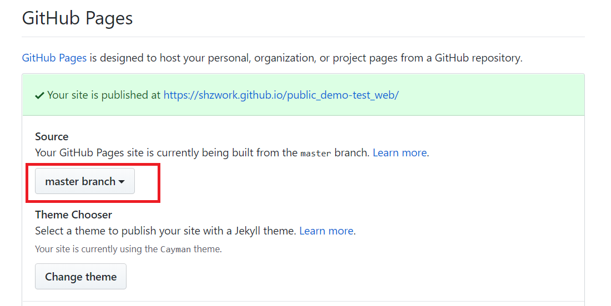

# 这是一个测试项目
This is a test demo !!

## 项目地址

### 源码地址

https://github.com/shzwork/public_demo-test_web

### 网页地址

https://shzwork.github.io/public_demo-test_web/

试试页面可以不可以访问

https://shzwork.github.io/public_demo-test_web/demo/test_json/News.01.01.01.01.txt

## GitHub Pages 相关

在线的  md编辑器 [editor on GitHub](https://github.com/shzwork/public_demo-test_web/edit/master/README.md)  

### 设置主页

项目设置页面中

https://github.com/shzwork/public_demo-test_web/settings

往下拉到 **GitHub Pages**

里面在有一个 **source** 可以选择 某一分支 比如 **master** 分支 做为主要显示的目录

**index.html**是固定的名称 主页就是它

访问地址 https://shzwork.github.io/public_demo-test_web/ 时， 就会主动显示它

参考：

https://www.jianshu.com/p/b6dfc7c886a9

https://www.cnblogs.com/M-M-Monica/p/9991923.html

### Markdown 文档

GitHub的官方说明  [GitHub Flavored Markdown](https://guides.github.com/features/mastering-markdown/).

### Jekyll Themes

GitHub显示主题，先不管吧 [repository settings](https://github.com/shzwork/public_demo-test_web/settings).  它的配置文件是 `_config.yml`  先不管吧

### Git帮助文档

[documentation](https://help.github.com/categories/github-pages-basics/) or [contact support](https://github.com/contact) and we’ll help you sort it out.